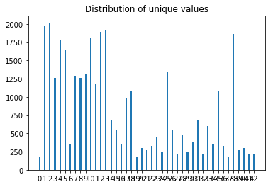
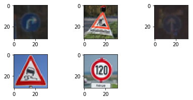

# German Traffic Sign
## Overview
This is Udacity project submission to demonstrate understanding of CNNs using TensorFlow. We are using German Traffic data set for training, validating and testing.

## Setup
You need to create Udacity AMI in Amazon cloud.
Run Jupyter notebooks
Required TensorFlow/Image Processing libraries

## Outline of steps performed:
Main code is in Traffic_Sign_Classifier-TBS.ipynb
Outline of steps for running Training/Testing
1. Load training data set images
2. Data Analysis : Review their distribution and other aspects to help choose pre-processing/processing parameters
3. Make necessary pre-processing decisions
4. Architecture: Configure LeNet with decided parameters
5. Train
6. Validate
7. Test
8. Take images from web and check on accuracy 
9. Top K hits

Below are some points explained in more detail :

## 3. Preprocessing
Image data is moved to gray scale and feature scaled that can bring mean around 0. Feature scaling  helps to avoid a single feature to dominate the distance.

## 2. Data analysis
Randomly reading some sample images and displaying to see their integrity and get the feel of data that we are dealing. 
After plotting the data distribution of training and test set it becomes clear it is skewed. I am not sure how to mitigate this. If data is not well distributed it could lead to overfitting and high accuracy in training but low accuracy in real world scenarios. For e.g. less number of road specific road sign, could lead to poor classification in real world. Resolution: We could fake data for the signposts that are low in number or reduce the numbers of signposts which are skewing the distribution.

## 4. Architecture
Used the LeNet Architecture with some modifications: 
1. Layer 1: Convolutional Input = 32x32x1. Output = 28x28x6 followed by activation
1. Pooling layer Input = 28x28x6. Output = 14x14x6
1. Layer 2: Convolutional. Output = 10x10x16 followed by activation
1. Pooling layer Input = 10x10x16. Output = 5x5x16
1. Flatten. Input = 5x5x16. Output = 400
1. Layer 3: Fully Connected. Input = 400. Output = 120 followed by activation 
1. Dropout
1. Layer 4: Fully Connected. Input = 120. Output = 84 followed by activation
1. Dropout
1. Layer 5: Fully Connected. Input = 84. Output = 10.

## 7. Test with images on web
Followin images were picked from web and tested.

rig
These images when ran with the trained model came with test set accuracy of 0.600. 
## Observations
1. After certain EPOCHs run, accuracy reaches platue and may start decreasing
2. Distribution of classified images was not good, which created bias in the CNN.
3. Top K gives a real good insight on what CNN has learnt and classifies. 

## Challanges
Based on my current understanding I am ranking the challanges CNN faces
1. Gathering clean, well distributed among (for output classes) normalized data set is the first starting point.
2. Architecture selection or modificaiton for CNN are relatively made easier with TensorFlow. However, understanding all parameters that TensorFlow needs is not easy
3. Running Real-world tests. Always fun but challenging with new inputs. Looking forward to work on continous feedback loop to adjust weights.
4. Need to figure out how to use Top K information to better train CNN

